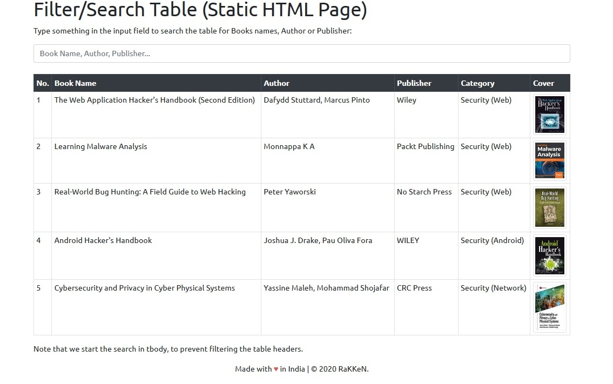
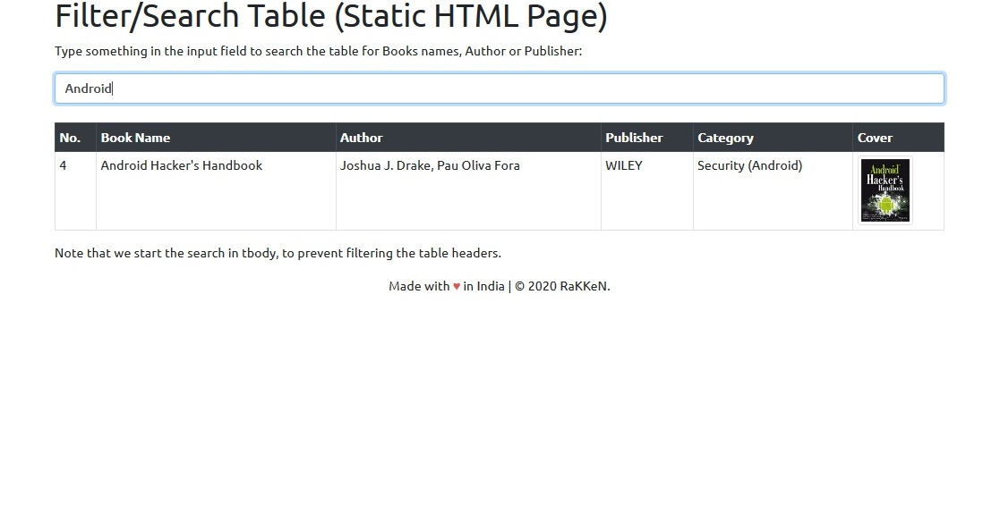

## Filter/Search Table Data (Static HTML Page)

This is one page Coding For Static HTML Page.
Usefull for maintain records.

#### How to Use:

1. Add record in html file (Using Table tag)

2. Search record 

__For Eg:__  "Android"

__Pros:__ 

- Simple HTML Coding.
- No Need any database server to maintain records.
- Easy to use.

__Cons:__ 

- To Enter All Record in HTML Page. (Add Data in Table TAG)
